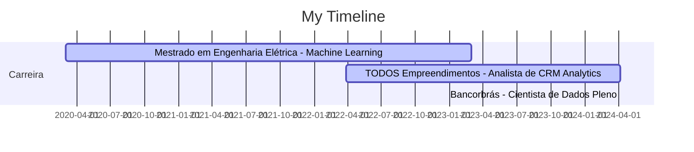

# Victor Oliveira

👨‍🏫 Master of Science in Electrical Engineering from the Federal University of Santa Catarina, specialized in data science and computer vision.

🛠️ Solid experience in Python, implementing machine learning models, and developing Data Science solutions.

📊 Proficient in data modeling using SQL and dbt, ensuring data efficiency and integrity for business areas.

🧑‍💼 Applying data science techniques to solve business challenges related to Customer Relationship Management (CRM).

🏆 Recognized by the ABM (Brazilian Association of Metallurgy, Materials, and Mining) as the best graduate of the Electrical Engineering course in 2019, by Unileste.

📝 🌱 Passionate about continuous learning in the field of Artificial Intelligence. Besides being a private Python and Machine Learning tutor, I share insights about Artificial Intelligence and Data Science on my Instagram profile: [Inteligência Programada](https://www.instagram.com/inteligencia.programada/)

## Technical Skills

- **Programming:** Python (+4 years), SQL (2 years)
- **Machine Learning:** Supervised and unsupervised models, Sklearn, TensorFlow, PyTorch, Keras
- **Cloud:** AWS EC2, AWS Athena, GCP (Vertex AI)
- **Data Modeling and Visualization:** Power BI, Streamlit, dbt, ETL
- **Tools and Platforms:** GitHub, AzureDevOps
- **Project Management:** Agile methodologies (Scrum), Management tools like Monday and Asana

## Atuação profissional

:computer: Analista de CRM Analytics - TODOS Empreendimentos (03.2022 - 04.2024)

:student: Aluno Pesquisador Mestrado - Universidade Federal de Santa Catarina (03.2020 - 03.2023)

## Featured Projects

1. **Churn prediction model:** Developed a machine learning model for churn prediction, achieving a 3x higher rate than the company's standard, enabling personalized retention campaigns.
2. **Probability model for debt repayment:** Calculates the probability of client debt repayment, resulting in +20.5% conversion and +15.3% monthly revenue increase.
3. **Default reduction:** Estimation of the probability of clients remaining in default, resulting in an average ROI of 190% with reconciliation campaigns.
4. **Data Analytics Framework for marketing campaigns:** Developed a Python framework and Power BI dashboard for product usage analysis, adhesion history, and marketing campaign tracking.
5. **Time to Value (TTV) indicator:** Evaluation of the initial value perception of the client using modeling in dbt (AWS Athena) and visualizations in Power BI.
6. **Target Audience Segmentation:** Precise segmentation of communication channels in marketing campaigns, calculating ROI and LTV projection.

## Connect with Me

- 📧 Email: victoroliveira.eng@hotmail.com
- 🔗 LinkedIn: [Victor Oliveira](https://www.linkedin.com/in/victoroliveraeng/)
- 📷 Instagram: [@inteligencia.programada](https://www.instagram.com/inteligencia.programada/)
